# Urine Stripes Analyzer

## Project Overview

The Urine Strip Analyzer project is designed to analyze images of urine strips and extract associated colors for medical diagnostics. The project operates under the following assumptions:
1. The input image is in `.jpg` format.
2. These image has making the colors distinguishable to the human eye.

### Screenshots


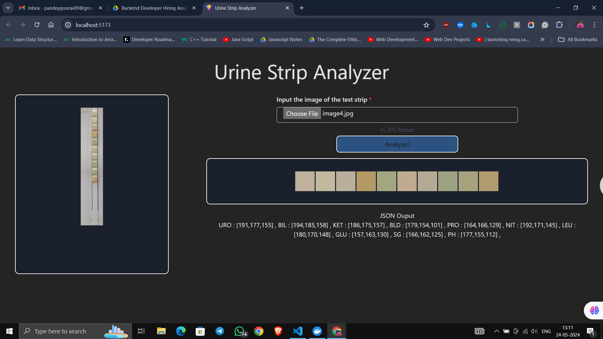
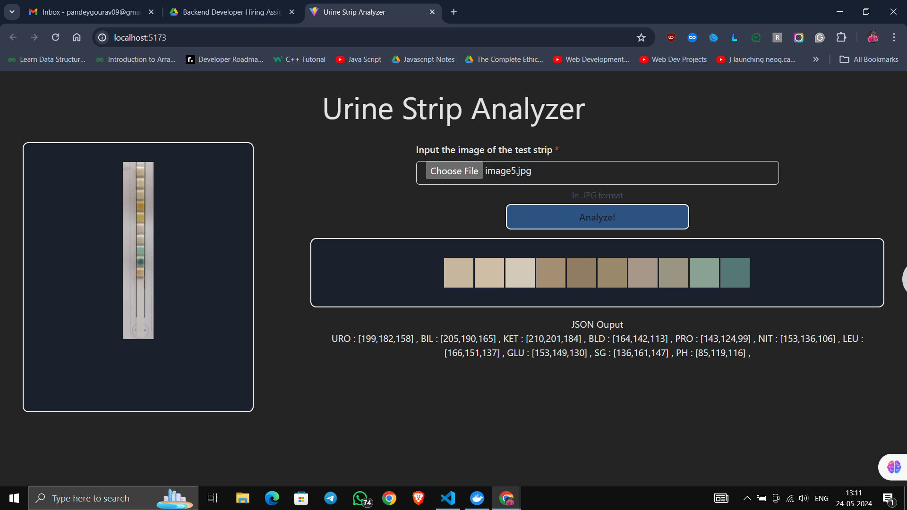
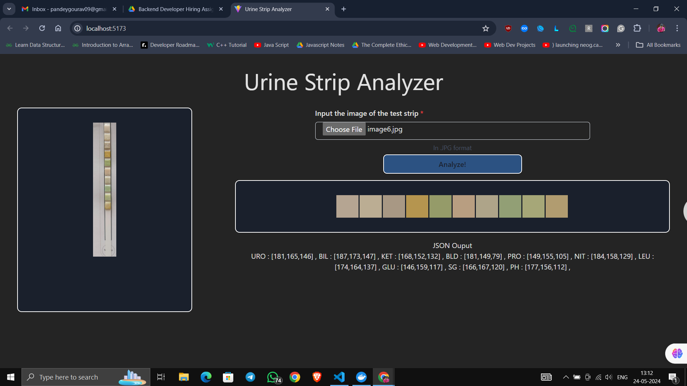
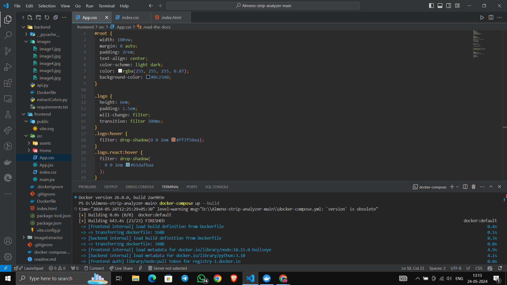
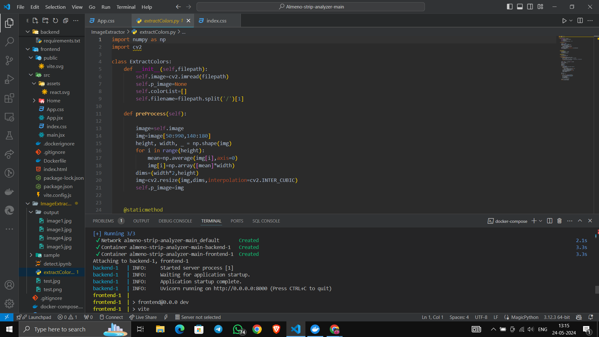
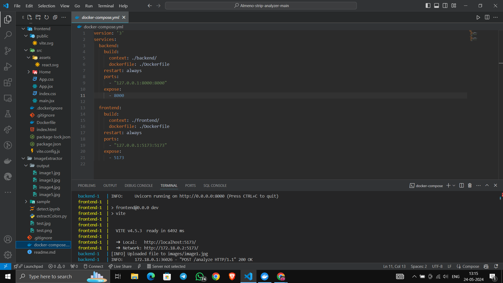
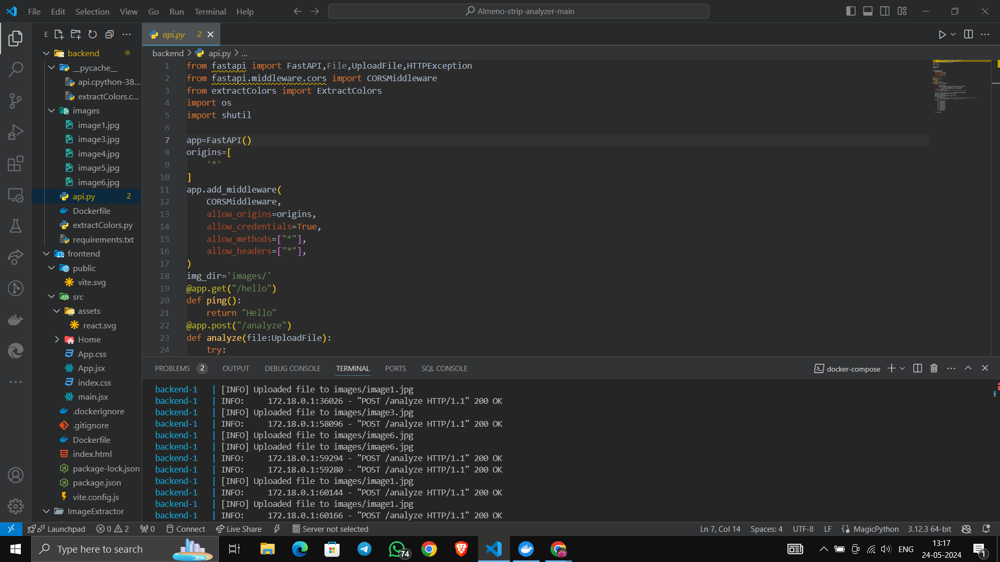
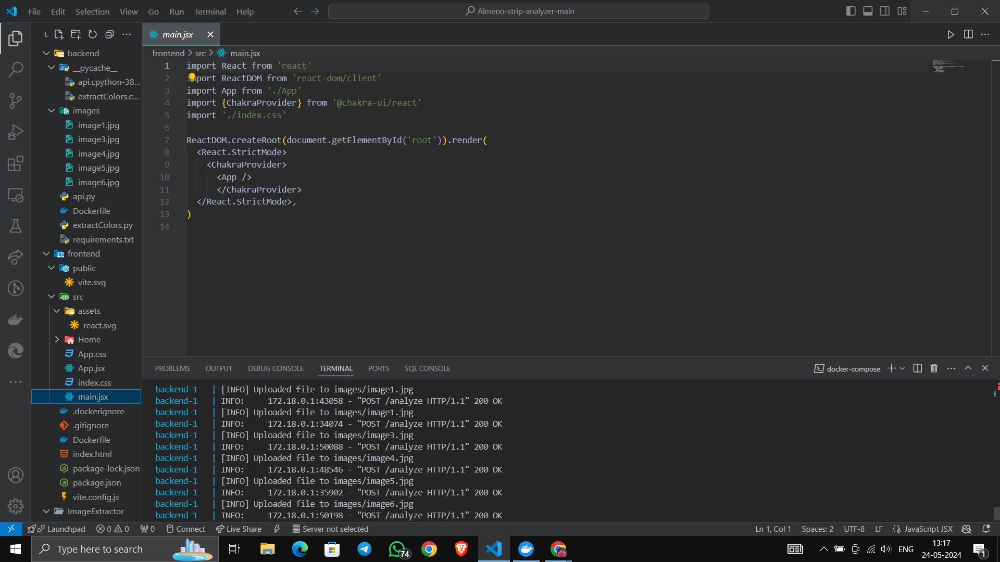
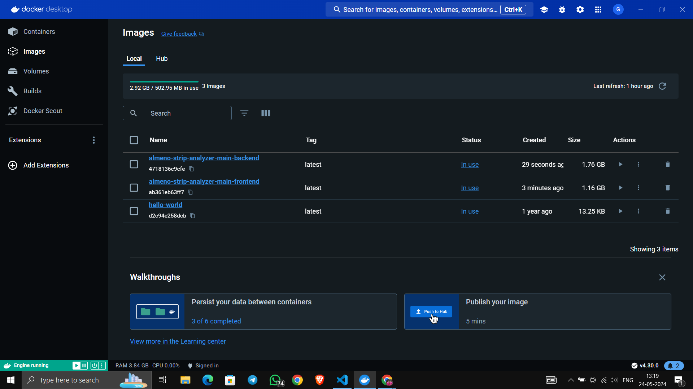
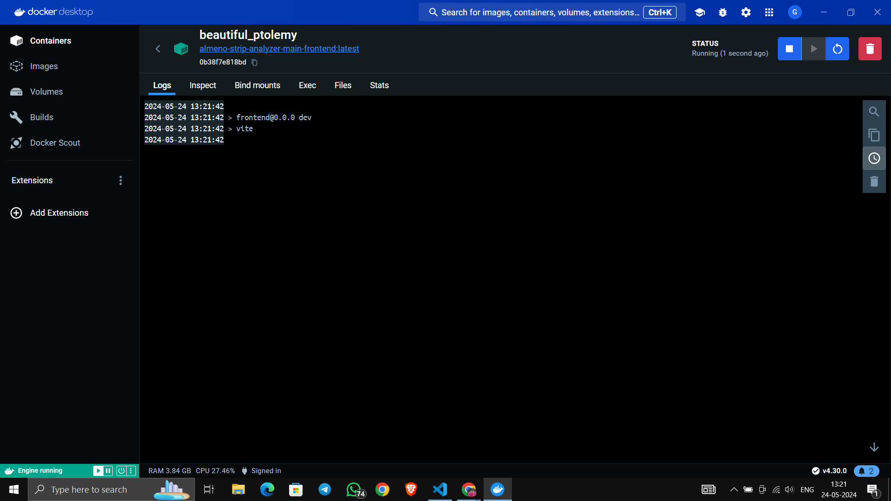
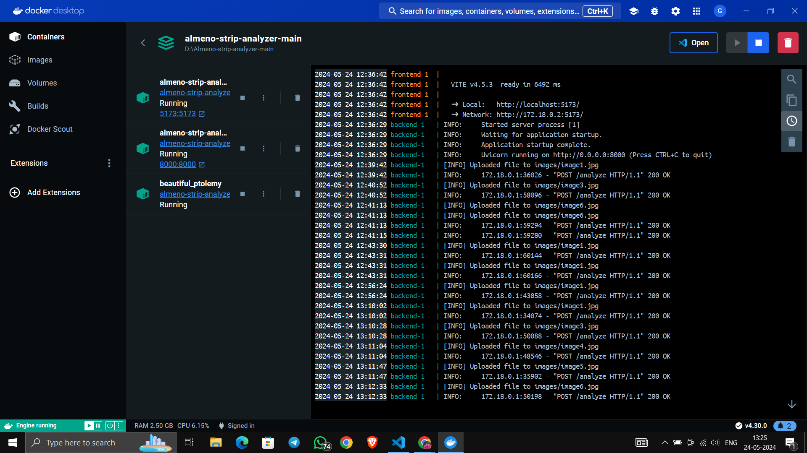
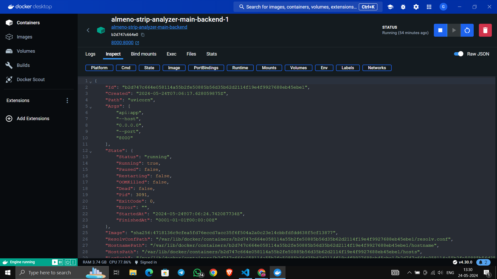
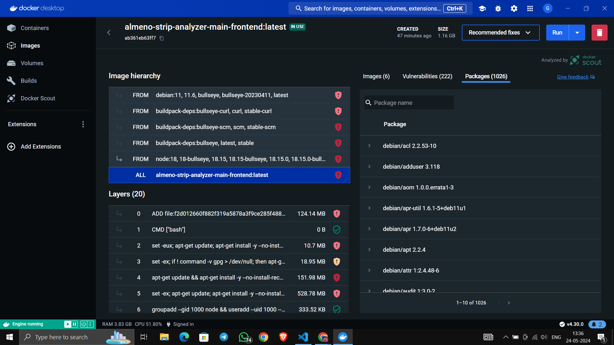

## Technology Stack

### Frontend

- **Framework**: ReactJS
- **Build Tool**: Vite
- **Component Library**: Chakra UI
- **HTTP Client**: Axios

### Backend

- **Framework**: FastAPI (Python)
- **ASGI Server**: uvicorn

## Methodology

### Color Extraction Process

The color extraction logic is encapsulated in the `extractColors.py` file and involves three main steps:

1. **Cropping**: The background is removed to prevent interference with color detection.
2. **Preprocessing**: A bilinear extrapolator is used to replace each pixel's value with the average value of the row, eliminating granular noise and dark patches.
3. **Segmentation**: Small segments (2x2 pixels) are extracted from the image using a vertical offset to capture the color from each square. The average value of these segments determines the final RGB value of each square.

## Deployment

### Using Docker and Docker Compose

Follow these steps to deploy the application:

1. Ensure Docker and Docker Compose are installed on your system.
2. Navigate to the root directory of the project.
3. Run the following command to build and start the application:

   ```sh
   docker-compose up
   ```

4. Open your browser and navigate to [http://localhost:5173](http://localhost:5173).
